  

<h1 align="center">re2-rs</h1>

✨ A fast, safe, and ergonomic  library for RE2 Rust bindings ✨

=======
Forked to work around some hard dependencies of the existing crate. Look to push back upstream.

Vendored in RE2 and abseil to avoid `pkg-config`

* RE2 - 2025-08-12
* Abseil - 20250512.1 - From https://github.com/google/re2/blob/2025-08-12/MODULE.bazel
* ICU - release-77-1

### RE2 Rust Bindings: ICU vs Non-ICU

| Feature                          | `re2-rs` (no ICU) | `re2-rs-icu` (with ICU) |
|----------------------------------|-------------------|--------------------------|
| ASCII matching (`\d`, `\w`, `\b`) | ✅ Supported       | ✅ Supported              |
| Unicode digit matching (`\d`)     | ❌ ASCII only      | ✅ All `Nd` digits (e.g. ٣٤٥) |
| Unicode word boundaries (`\b`)    | ❌ ASCII only      | ✅ Works across all scripts (e.g. Greek, Cyrillic, etc.) |
| Unicode case folding (`(?i)`)     | ❌ ASCII only      | ✅ Full Unicode (ß → SS, Greek, Cyrillic, etc.) |
| POSIX syntax (`Options::posix_syntax`) | ✅ Supported | ✅ Supported              |
| Longest match (`Options::longest_match`) | ✅ Supported | ✅ Supported              |
| Unicode script / property classes (`\p{Greek}`, `\p{Cyrillic}`, etc.) | ❌ Unsupported | ✅ Supported |
| Emoji support (`\p{Emoji}`)       | ❌ Unsupported     | ✅ Supported (e.g. 😀👍)   |
| Collation-sensitive matching      | ❌ Unsupported     | ✅ Supported              |

```mermaid
graph TD
    subgraph Native
        CppSources["RE2 + Abseil (C++)"]
        ICU["ICU (C++)"]
    end

    re2_rs_sys["re2-rs-sys 🔴 <br/>Raw FFI (extern C)<br/>build.rs compiles C++<br/>pregenerated bindings"]
    re2_rs_wrapper["re2-rs-wrapper 🟠<br/> Safe Rust API<br/>(Regex, Options)"]
    re2_rs["re2-rs 🟢<br/> Public crate<br/>plain RE2"]
    re2_rs_icu["re2-rs-icu 🟢<br/> Public crate<br/>RE2 + ICU"]

    CppSources --> re2_rs_sys
    re2_rs_sys --> re2_rs_wrapper
    re2_rs_wrapper --> re2_rs
    re2_rs_wrapper --> re2_rs_icu

    %% ICU is optional
  ICU -.-> re2_rs_sys

```

### re2-rs-sys 🔴
Low-level FFI bindings.
* Owns all the C++ compilation (build.rs).
* Owns c-bindings.cc / c-bindings.h.
* Exposes raw FFI (extern "C" { ... }).
* Unsafe, not for direct use

### re2-rs-wrapper 🟠
Safe, idiomatic Rust API.
* Defines the Regex and Options types.
* Wraps re2-rs-sys functions with error handling and lifetimes.
* Feature icu enables ICU-aware constructors (with_options).

### re2-rs 🟢
Public crate for plain RE2.
* Re-exports the safe API from re2-rs-wrapper.
* Compiled without ICU feature.

### re2-rs-icu 🟢
Public crate for RE2 with ICU.
* Re-exports the same safe API.
* Compiled with ICU feature, enabling Regex::with_options and Unicode folding.

### tests/ (in parent)

* Runs against both crates.
    * common.rs: shared functionality.
    * unicode.rs: ICU-specific tests.

Uses [dev-dependencies] in the parent Cargo.toml to pull in both wrappers.

### 🚀 Pipeline

`cargo test -p re2-rs` → runs crate-local + shared tests (common.rs).

`cargo test -p re2-rs-icu` → runs crate-local + shared + unicode tests.

`cargo test` in the workspace → runs everything.

E2’s Options like set_case_sensitive(false), set_posix_syntax(true)),
so you can test ICU features like collation and script matching?
ICU-specific extensions (case folding, script properties, etc).    

regen bindings (avoids llvm requirement) 

`cargo run -p xtask` -- regen-bindings

`cargo build -p re2-rs` → no ICU sources compiled, smaller artifact

`cargo build -p re2-rs-icu --features icu` → ICU gets built in.

# TODO
**Fix version numbers!**

**Github action to matrix build it - without and without bindgen**

If you need normalization (NFC/NFKC) or locale collation, do it as a preprocess with ICU, then feed the result to RE2. //TODO how?
Features Still Missing or Under-Tested

Anchors and line modes

(?m) multi-line → ^/$ match start/end of line.

(?s) dotall → . matches newlines.

Tests missing: especially with Unicode newlines.

Word boundaries with mixed scripts

ICU \b should handle boundaries between scripts (e.g. Latin + Cyrillic).

Test missing: "HelloЗдравей" shouldn’t count as a single word.

Collation-sensitive matching (ICU)

RE2+ICU can use ICU collators for locale-sensitive string equivalence.

Not in your wrapper yet (re2::RE2::Options::set_collator).

Unicode categories

\p{L} (letters), \p{Nd} (decimal digits), \p{P} (punctuation), etc.

Tests missing: show broad categories beyond Greek/Cyrillic.

Replace semantics with Unicode

Regex::replace_one / replace_all are implemented.

Tests missing: e.g. replace emoji with placeholder, or fold case + replace.

Match longest vs shortest (longest_match)

Should be tested explicitly with Unicode text.

🟢 Next Steps (Recommendations)

Add ICU option shims for:

re2_options_set_unicode_case

re2_options_set_unicode_word_boundaries

(optionally) re2_options_set_collator

Expand test coverage:

Anchors ((?m), (?s)) with Unicode input.

Mixed-script boundaries (Latin + Cyrillic/Greek).

General Unicode categories (\p{L}, \p{P}, etc.).

Replace tests with Unicode/emoji.

Collation tests (once bindings are in).