<p align="center">
  
</p>
<h1 align="center">re2-rs</h1>
<p align="center">🔍 (Will be) Fast, safe, and ergonomic Rust bindings for RE2 with ICU 🧩</p>


<p align="center">
  <a href="https://crates.io/crates/my_crate">
    
  </a>
  <a href="https://docs.rs/my_crate">
    
  </a>
  <a href="https://github.com/user/my_crate/actions">
    
  </a>
<a href="https://codecov.io/github/robyeates/re2-rs" > 
  
 </a>
  <a href="#license">
    
  </a>
</p>

*** 
Unpublished - in Development!
*** 

This project began as a fork to work around hard dependencies in the existing ecosystem, but has since grown into a fully standalone set of crates.

Dependencies are vendored directly to ensure reproducible builds and to keep `re2-rs` minimal. The goal is to provide a **small, 
dependency-free baseline (`re2-rs`)** with the essential RE2 features, and a **superset (`re2-rs-icu`)** that exposes ICU’s extended Unicode functionality.

Vendored versions are pinned to exact upstream releases:

- **RE2**: 2025-08-12
- **Abseil**: 20250512.1 (from [RE2’s `MODULE.bazel`](https://github.com/google/re2/blob/2025-08-12/MODULE.bazel))
- **ICU**: release-77-1

### RE2 Rust Bindings: ICU vs Non-ICU
| Feature                          | `re2-rs` (no ICU) | `re2-rs-icu` (with ICU) |
|----------------------------------|-------------------|--------------------------|
| ASCII matching (`\d`, `\w`, `\b`) | ✅ Supported       | ✅ Supported              |
| Unicode digit matching (`\d`)     | ❌ ASCII only      | ✅ All `Nd` digits (e.g. ٣٤٥) |
| Unicode word boundaries (`\b`)    | ❌ ASCII only      | ✅ With `Options::unicode_word_boundaries(true)` |
| Unicode case folding (`(?i)`)     | ❌ ASCII only      | ✅ Full Unicode (ß → SS, Greek, Cyrillic, etc.) |
| POSIX syntax (`Options::posix_syntax`) | ✅ Supported | ✅ Supported              |
| Longest match (`Options::longest_match`) | ⚠️ Compiles, but no effect via wrapper yet | ⚠️ Same — needs C++ shim work to expose |
| Unicode script / property classes (`\p{Greek}`, `\p{Cyrillic}`, etc.) | ⚠️ Limited set (built-in RE2 tables) | ✅ Full ICU property set |
| Emoji support (`\p{Emoji}` etc.)  | ❌ Unsupported     | ✅ Supported (e.g. 😀👍, modifier bases, etc.) |
| Collation-sensitive matching      | ❌ Unsupported     | ❌ Unsupported (requires ICU regex, not RE2) |

> Notes:
> - `\d`, `\w`, `\b` are **ASCII-only** unless `unicode_word_boundaries(true)` is enabled.
> - **re2-rs** provides a limited set of Unicode scripts/categories baked into RE2.
> - **re2-rs-icu** exposes ICU’s full property set, case folding, digits, emoji, etc.
> - `longest_match` is not currently observable through this wrapper.
> - Collation-sensitive regex is only available in ICU’s own regex engine, not RE2.

```mermaid
%%{init: {"theme":"dark", "themeVariables": { "fontSize": "12px" }, "scale": 0.6 }}%%
graph TD
    subgraph Native
        CppSources["RE2 + Abseil (C++)"]
        ICU["ICU (C++)"]
    end

    re2_rs_sys["re2-rs-sys 🔴 <br/>Raw FFI (extern C)<br/>build.rs compiles C++<br/>pregenerated bindings"]
    re2_rs_wrapper["re2-rs-wrapper 🟠<br/> Safe Rust API<br/>(Regex, Options)"]
    re2_rs["re2-rs 🟢<br/> Public crate<br/>plain RE2"]
    re2_rs_icu["re2-rs-icu 🟢<br/> Public crate<br/>RE2 + ICU"]

    CppSources --> re2_rs_sys
    re2_rs_sys --> re2_rs_wrapper
    re2_rs_wrapper --> re2_rs
    re2_rs_wrapper --> re2_rs_icu

    %% ICU is optional
  ICU -.-> re2_rs_sys

```



### 🚀 Pipeline

`cargo test -p re2-rs` → runs crate-local + shared tests (common.rs).

`cargo test -p re2-rs-icu` → runs crate-local + shared + unicode tests.

`cargo test` in the workspace → runs everything.

Regen bindings (avoid llvm requirement by using the bundled `bindings.rs`) 

`cargo run -p xtask` -- regen-bindings

`cargo build -p re2-rs` → no ICU sources compiled, smaller artifact

`cargo build -p re2-rs-icu --features icu` → ICU gets built in.

### Building with ICU (`re2-rs-icu`)

The `re2-rs-icu` crate depends on ICU. How it is linked depends on the platform:

#### Windows
On Windows, you need to supply a prebuilt ICU distribution. The build script looks for an environment 
variable `ICU_ROOT` pointing to an unpacked ICU zip.

Example (ICU 77.1, MSVC 2022 build): - [icu4c-77_1-Win64-MSVC2022.zip](https://github.com/unicode-org/icu/releases/download/release-77-1/icu4c-77_1-Win64-MSVC2022.zip)

Unpack this somewhere and set:

```powershell
setx ICU_ROOT "C:\path\to\icu4c-77_1-Win64-MSVC2022"
```
Then build:

`cargo build -p re2-rs-icu --features icu`

The build will link against `ICU_ROOT\include` and `ICU_ROOT\lib64`, and attempt to copy the required DLLs
into Cargo’s `target\...\deps` directory so tests can run.

Expected DLLs (for ICU 77.1):

* `icuuc77.dll`
* `icuin77.dll`
* `icudt77.dll`
* `icutu77.dll`

⚠️ Note: Windows builds are currently aimed at development and testing only. If the DLLs are not found or
not copied, you may see STATUS_DLL_NOT_FOUND when running tests.
Static linking of ICU is not supported at this time.

#### Linux / macOS

On Unix platforms, ICU is discovered via pkg-config.
Install the system ICU development libraries (e.g. `libicu-dev` on Debian/Ubuntu, `icu` on Fedora,
`icu4c` on macOS/Homebrew), then build as usual:

`cargo build -p re2-rs-icu --features icu`

ℹ️ The build script first checks ICU_ROOT (Windows).
If unset, it falls back to pkg-config (Linux/macOS).

## TODO
* Dedupe tests
* Docs, link the (corrected) feature table to test line number
* ~~Github action to matrix build it - without and without bindgen~~
* Add full `Anchor` support - `longest_match` currently doesn't pass through the shim
* Improve error handling - [spack-rs](https://github.com/cosmicexplorer/spack-rs/blob/main/re2/src/error.rs) has a full shim
* Other features as required

### Might do
* Expose normalisation (NFC/NFD) from ICU e.g.
   * ```
      let normalizer = Normalizer2::get_nfc_instance().unwrap();
     
      let pattern = normalizer.normalize("café").unwrap();
      let text = normalizer.normalize("cafe\u{301}").unwrap();

      let re = Regex::new(&pattern).unwrap();
      assert!(re.full_match(&text));```    

### Probably not doing
* Collation-sensitive matching - RE2 doesn't have this, it's extending/forking to deliver this 

